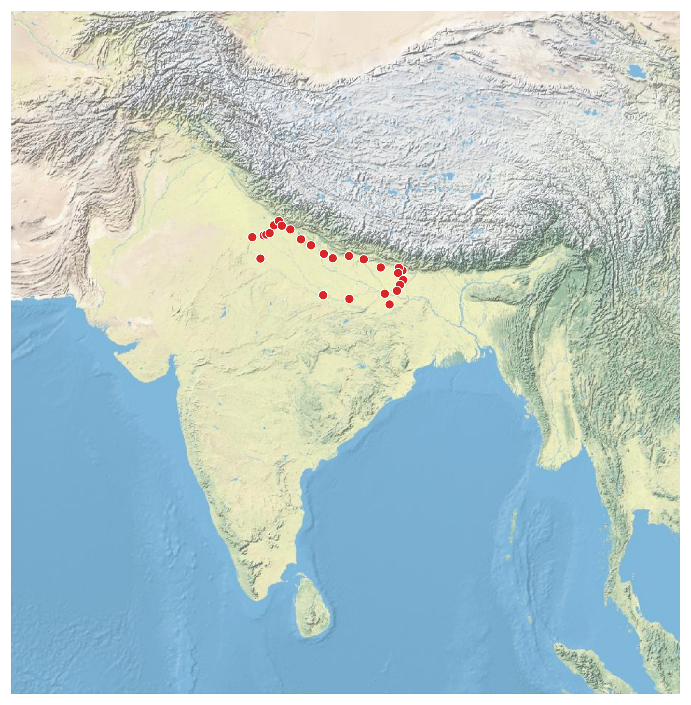
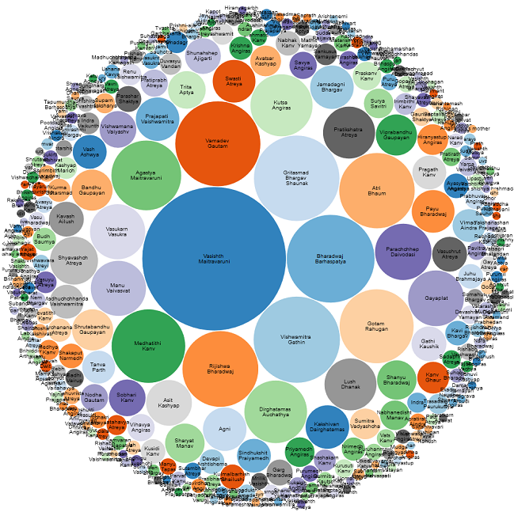

# Indica APIs

The following APIs are available: 

- Rig Veda API: Metadata for the Rig Veda. Contains info about the gods and poets, their categories, and poem meters used in all of the Rig Veda verses
- Vedic Soceity API: Descriptions of all the nouns  mentioned in vedic literature (proper nouns aren't included, though)
- Mahabharat API: Information about people and events in the Mahabharat

## Documentation

See [Indica documentation](https://aninditabasu.github.io/indica/). 

## How to use

The APIs are openly available through `GET` calls, and return data in the `JSON` format. You can programmatically process the data to make visually appealing or easily consumable information.

