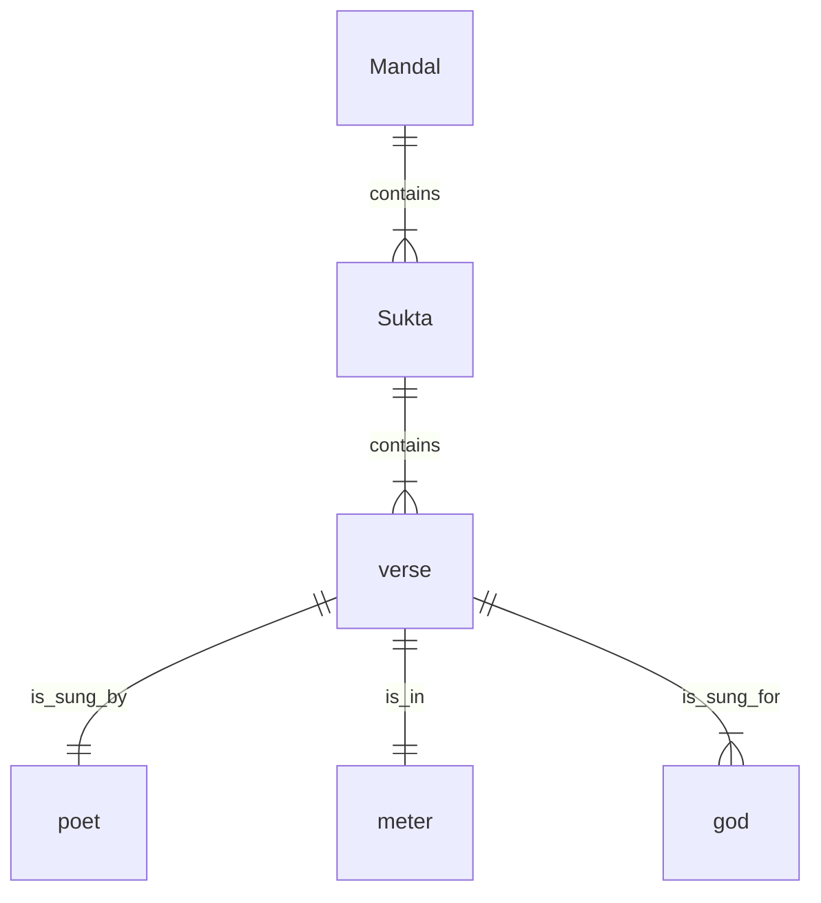

# About the Rig Veda API

<hr/>

This API contains metadata from Rig Veda Samhita. Data from the other three samhitas (Yajurveda, Samaveda, and Atharvaveda) are not included, because most of the verses in these three samhitas are a repetition of the verses in Rig Veda Samhita. 

The data is from the following books: 
	
- Rig Veda Samhita, the English translation according to H. H. Wilson and the Bhashya of Sayanacharya, by Ravi Prakash Arya and K. L. Joshi (Volumes 1 through 4)
-  [The Practical Sanskrit-English Dictionary, by V. S. Apte](https://dsal.uchicago.edu/dictionaries/apte/)

The data is returned in the following format:

=== "Schema"

    ```json
    {
      "mandal": 0,
      "sukta": 0,
      "meter": "string",
      "sungby": "string",
      "sungbycategory": "string",
      "sungfor": "string",
      "sungforcategory": "string"
    }
    ```

=== "Example response"

    ```json
	{
    	"mandal": 10,
	    "meter": "Jagati",
	    "sukta": 75,
	    "sungby": "Sindhukshit Praiyamedh",
	    "sungbycategory": "human male",
	    "sungfor": "Ganga",
	    "sungforcategory": "divine female"
	}
	```

In Rig Veda, books (or mandals) contain chapters, and chapters (or suktas) contain verses (or richas). A book has several chapters. A sukta has several verses. Within a sukta, each verse can be in different meter and addressed to more than one god. Within a sukta, the verses can be composed by more than one poet. See the following entity-relationship diagram.



Rig Veda API fetches the metadata of verses and, therefore, contains a separate entry for each of these possibilities wherever they occur.

For example, consider sukta 24 of mandal 1. It has verses addressed to five gods, all in different meters. The API response for the verses in this mandal-sukta combination is something like this:

```json
  {
    "mandal": 1,
    "sukta": 24,
    "sungby": "Shunahshep Ajigarti",
    "sungbycategory": "human male",
    "sungfor": "Ka",
    "sungforcategory": "divine male",
    "meter": "Trishtup"
  },
  {
    "mandal": 1,
    "sukta": 24,
    "sungby": "Shunahshep Ajigarti",
    "sungbycategory": "human male",
    "sungfor": "Agni",
    "sungforcategory": "divine male",
    "meter": "Trishtup"
  },
  {
    "mandal": 1,
    "sukta": 24,
    "sungby": "Shunahshep Ajigarti",
    "sungbycategory": "human male",
    "sungfor": "Savita",
    "sungforcategory": "divine male",
    "meter": "Gayatri"
  },
  {
    "mandal": 1,
    "sukta": 24,
    "sungby": "Shunahshep Ajigarti",
    "sungbycategory": "human male",
    "sungfor": "Bhaga",
    "sungforcategory": "divine male",
    "meter": "Gayatri"
  },
  {
    "mandal": 1,
    "sukta": 24,
    "sungby": "Shunahshep Ajigarti",
    "sungbycategory": "human male",
    "sungfor": "Varun",
    "sungforcategory": "divine male",
    "meter": "Trishtup"
  }
```

## Related

-  [Rig Veda API reference](api_rv.md)
-  [Tutorial: Vedic soliloquies](how_to_soliloquy.md)

<hr/>

