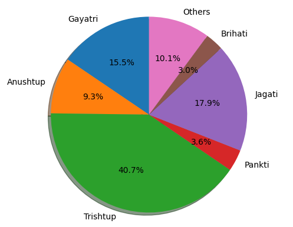
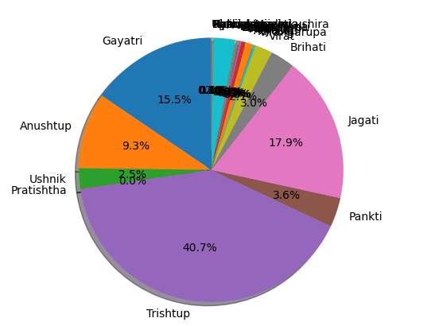
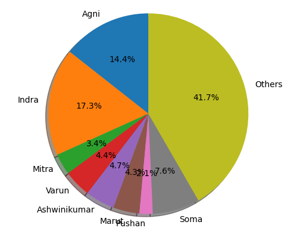
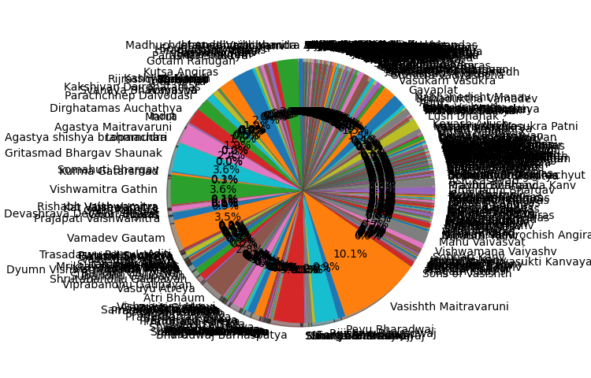
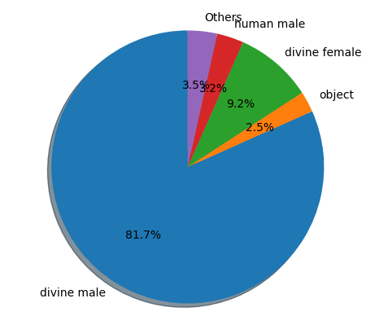

# Pie chart: Poetic meters

<hr/>

Poetry is always meant to rendered aloud and, during its recitation, it's the _meter_ that sets its rhythm. Consider the following example, and read it out aloud. Your vocals will, in all probability, follow the pattern shown on the second content tab. 

=== "No marks"

    Poem, when read silently as text

    ```text
    In the midst of the word he was trying to say,
    In the midst of his laughter and glee,
    He had softly and suddenly vanished away
    For the Snark was a Boojum, you see.

    - Carrol, Lewis. "The Hunting of the Snark".
    ```

=== "Stress points marked with `/`"

    Poem, showing the places where the sound has greater stress 

    ```text
    In the midst / of the word / he was try/ing to say,
    In the midst/ of his laugh/ter and glee,
    He had soft/ly and sud/den ly van/ ish ed away
    For the Snark / was a Boo/jum, you see.

    - Carrol, Lewis. "The Hunting of the Snark".
    ```

Rig Veda is poetry. Its verses have a certain lilt, beat, rhythm, and meter that turn the words into charming lyrical music when recited aloud. Stressing the incorrect syllable can alter the entire meaning of a mantra. Traditional methods, transmitted orally, teach people which parts of a word must be stressed. In these modern times, printed books also carry this information.  See, for example, this verse, with and without marks on the stress points.

=== "No marks"

    ```text
    तत्सवितुर्वरेण्यं भर्गो देवस्य धीमहि ।
    धियो यो नः प्रचोदयात् ॥

    - Rig Veda, 3.62.10
    ```

=== "Marked with `'`"

    ```text
    तत्स॑वि॒तुर्वरे॑ण्यं॒ भर्गो॑ दे॒वस्य॑ धीमहि ।
    धियो॒ यो नः॑ प्रचो॒दया॑त् ॥
    
	- Rig Veda, 3.62.10
    ```

This tutorial shows you how to draw a piechart of the vedic meters.



## Algorithm

All the path parameters in the [Rig Veda API](api_rv.md) return a response in the same JSON structure.

```json
{
  "mandal": 0,
  "sukta": 0,
  "meter": "string",
  "sungby": "string",
  "sungbycategory": "string",
  "sungfor": "string",
  "sungforcategory": "string"
}
```

In Rig Veda, books (or mandals) contain chapters, and chapters (or suktas) contain verses. Each verse is composed in one - and only one - meter.

!!! tip "Entity relationship"

    For information on how mandals, suktas, poets, and gods are connected to each other, see the entity-relationship diagram at [About Rig Veda](about_rv.md).

The following pseudocode uses the `/book/{mandal}` path parameter to fetch the data for meters, and generate the label names and numbers for a pie chart.

```bash
while book_number < 11:
	GET /book/book_number
	for entry in GET_response:
		add <meter> to meter_list
	book_number = book_number + 1
count (<meter> in meter_list)
count (sum of occurence of <meter> in meter_list)
plot chart:
	labels = <meter>
	sizes = sum of occurence
```

After collecting the data, use your favourite data-visualiser to create a pie chart. The following example code uses the `matplotlib` Python package.

## Example code in Python

1.  Make a `GET` call for the first mandal.

    ```python
	headers = {
	    'accept': 'application/json',
	}

	url = "https://api-rv.herokuapp.com/rv/v2/meta/book/1"

	import json
	
	response = requests.get(url, headers=headers)
	response_json = json.loads(json.dumps(response.json()))
	```

1.  Loop through the returned JSON, pick `meter`, and add it to a list.

    ```python
	meters = []
	
	for entry in response_json:
		meters.append(entry['meter'])
	```

1.  Make a `GET` call for mandals 2 through 10, pick the meters, and append them to the `meters` list.
1.  Count the number of occurence of each meter.

    ```python
	from collections import Counter
	
	counts = Counter(meters)
	#print(len(counts), counts)
	```
	
1.  From the counter dictionary, extract the meter names and numbers. Then, use the `matplotlib` library to draw the pie chart.

    ```python
	labels = []
	sizes = []
	for item in counts:
	#    print(item, counts[item])
	    labels.append(item)
	    sizes.append(counts[item])
	#print(len(labels), labels)
	#print(len(sizes), sizes)
	
	import matplotlib.pyplot as plt

	fig1, ax1 = plt.subplots()
	ax1.pie(sizes, labels=labels, autopct='%1.1f%%', shadow=True, startangle=90)
	ax1.axis('equal')
	plt.show()
	```

## Results

You should be able to see a pie chart like this:



As you can see, a bunch of meters are so small that they have tiny slices in the pie and their names form a blur of overwritten text. One option for getting a neater chart is to club all such tiny slices together into one larger slice. In the following code snippet, all slices that are smaller than 3% of the total are clubbed into one slice.

```python
labels = []
sizes = []
others = 0
for item in counts:
#	print(item, counts[item])
	if int(counts[item])/total > 0.03:
	    labels.append(item)
	    sizes.append(counts[item])
	else:
	    others = others + int(counts[item])
#	print(len(labels), labels)
#	print(len(sizes), sizes)
	labels.append("Others")
	sizes.append(others)
#	print(len(labels), labels)
#	print(len(sizes), sizes)
```
	
## What to do next

You can generate similar piecharts of the gods in a mandal, or all gods in all mandals, or a specific god in all mandals. Ditto for the poets.

=== "Pie chart, gods"

    

=== "Pie chart, poets"

    

=== "Pie chart, god categories"

    

## More HowTo-s

See [Index](tags.md).

<hr/>


