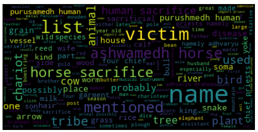

# Word cloud: Noun descriptions

<hr/>

A _word cloud_ is an image composed of words in a book or large piece of text, where the size of the words in the image is indicative of their frequency of occurence in the text. 

This tutorial shows you how to use the noun descriptions in the [Vedic Society API](api_vs.md) to generate a word cloud.

## Algorithm

All the path parameters in the [Vedic Society API](api_vs.md) return a response in the same JSON structure.

```json
{
  "nagari": "string",
  "word": "string",
  "description": "string",
  "category": "string"
}
```

To create the corpus for the word cloud, you need the values from all the `description` parameters. To do so, you use the `categories/{category}` path parameter, and fetch the words for all categories one by one. 

The following pseudocode shows how to generate the corpus.

```bash
category_list = [all categories mentioned in the documentation]
where /categories/{category} == <item from category list>:
	get description
    append to word_list
convert word_list to word_text
```

After generating the corpus, use your favourite data-visualiser to create a word cloud. The following example code uses the WordCloud for Python package.

## Example code in Python


This example uses the [WordCloud for Python](https://amueller.github.io/word_cloud/index.html) package.


1.  Create a list of categories available in the API.

    ```python
	category_list = [..., mountain, place, river, ...]
	```

1.  Make a `GET` call for the first item in `category_list`. For example, the following code shows a call for the `clothing` category.

    ```python
	headers = {
	    'accept': 'application/json',
	}

	url = "https://api-vs.herokuapp.com/vs/v2/categories/clothing"

	response = requests.get(url, headers=headers)
	response_json = json.loads(json.dumps(response.json()))
	```

1.  Loop through the returned JSON, pick `description`, and add it to a list.

    ```python
	word_list = []
	
	for entry in response_json:
		word_list.append(entry['description'])
	```

1.  Make a `GET` call for the next category on the list, pick the description, and append it to `word_list`.
1.  Convert the list to a single block of text, where each list item is separated by a single space.

    ```python
	
	text = " ".join(word_list)
	
	```

1.  Use `pip` to install the `wordcloud` package in your environment, and then use the following code to create the word cloud.

    ```python
	# generate a word cloud image
	wordcloud = WordCloud().generate(text)

	# lower max_font_size
	wordcloud = WordCloud(max_font_size=40).generate(text)
	
	# plot the chart
	plt.figure()
	plt.imshow(wordcloud, interpolation="bilinear")
	plt.axis("off")
	plt.show()
	```

## Results

You should be able to see a pie chart like this:



## What to do next

You can generate similar word clouds for the several categories separately.

## More HowTo-s

See [Index](tags.md).

<hr/>


