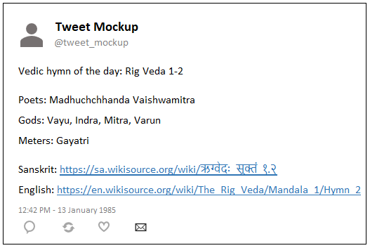
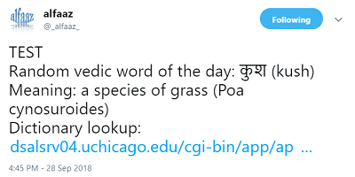
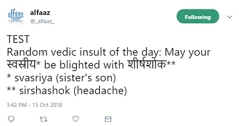
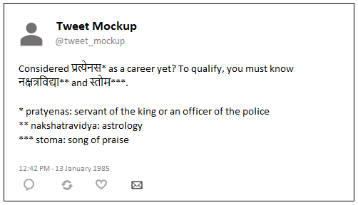
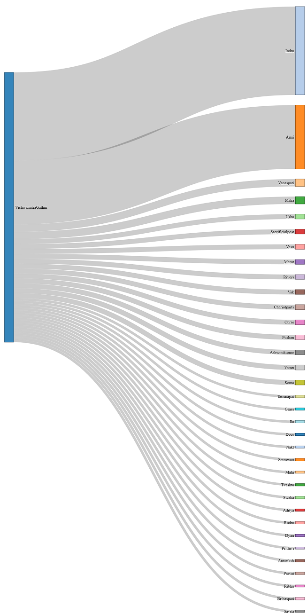
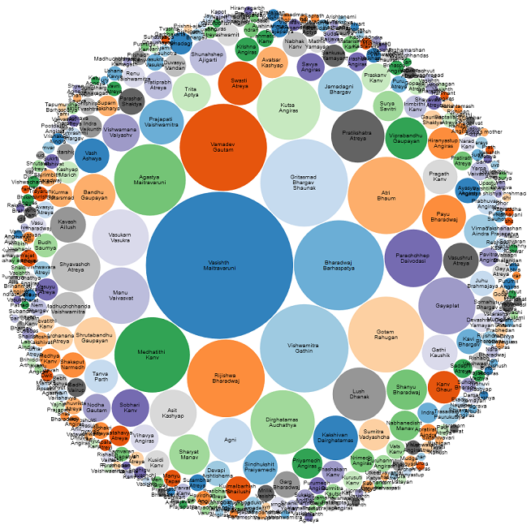
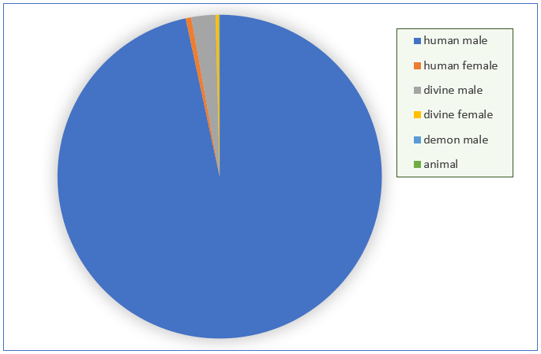

Here's a [fun career advice app](https://github.com/AninditaBasu/indica/blob/master/tarzezindagi.py).

And, this is [a fictional take on the life of a child in vedic times](https://life-ancient-india.herokuapp.com/).

Some more ideas are listed on this page.

## Teaching aids

Use the data to weave stories.

=== "Rig Veda API"

    -  Position of women in society. Pick the verses where `'sungbycategory' == 'human female'`
    -  Soliloquies. Pick the verses where `'sungby' == 'sungfor'`
	
=== "Vedic Society API"

    -  Geography of ancient India. Pick the entries where the parameter is `category`, and the values are `mountain`, `place`, or `river`.
	-  Jobs and employment.  Pick the entries where the parameter is `category`, and the value is `occupation`.

## Twitter bots

### Rig Veda API

Link up with other resources to tweet a vedic hymn a day.

1.  Pick the `mandal` and `sukta`.
1.  Append this number to the base URL of the external resource that contains the hymn. For example, if the base URL is `https://en.wikisource.org/wiki/The_Rig_Veda/`, create `https://en.wikisource.org/wiki/The_Rig_Veda/Mandala_<1>/Hymn_<2>`.
1.  If you want the sanskrit text as well, do these two additional things:
    1.  Translate the numbers into the nagari script. For example, if `mandal` is 1 and `sukta` is 2, create `<१.२>`.
    1.  Append this number to the base URL of the wikisource pages that contains the Rig Veda Samhita texts. For example, if the base URL is `https://sa.wikisource.org/wiki/ऋग्वेदः_सूक्तं_`, create `https://sa.wikisource.org/wiki/ऋग्वेदः_सूक्तं_१.२`
1.  Tweet the details as a Vedic Hymn Of The Day.



### Vedic Society API

Tweet a word a day

:   

    Example code:
	
	```python

	...
	for k,v in (api_data[random_word]).items():
    	if k == 'nagari':
        	hindi = str(v)
    	if k == 'description':
        	meaning = str(v)
	...

	tweet_text = 'TEST' + '\nRandom vedic word of the day: ' + hindi + ' (' + translit + ')' '\nMeaning: ' + meaning + '\nDictionary lookup: ' + apte_url
	```
Tweet an insult a day

:   

    Example code:
	
	```python
	...
	May your {'nagari' where 'category'='family'} be blighted with {'nagari', where 'category'='disease'}
	\n
	* 'word' ('description')
	\n
	** 'word' ('description')
	...
	```

Give career advice

:   

    Example code:
	
	```shell
	Considered <nagari> from <category=occupation>
	as a career yet? To qualify, you must know <nagari> of 
	<one random item> from <category=subject> and 
	<category=literature>.
	- <word>, <description>
	- <word>, <description>
	- <word>, <description>
	```

## Infographics

Who all did Vishwamitra sing to?</h4>

:   

Who all were the composers of the verses in the Rig Veda verses?

:   

Who are the gods in Rig Veda? How many verses do they have to themselves?

:   

Who sang the Rig Veda verses? How many?

:   

<hr/>

<a href="https://whimsy.myinstamojo.com/product/480613/coffee-ddbc0/" data-store-name="whimsy" data-domain="https://whimsy.myinstamojo.com" data-id="480613" rel="im-new-checkout" data-text="Like this API? Buy me a coffee." data-css-style="background:#1273de; color:#ffffff; width:300px; border-radius:30px" data-layout="vertical"></a>
<script src="https://manage.instamojo.com/assets/js/pay_button/button.min.js"></script>
