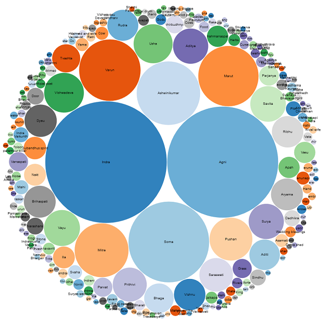

# The Indica APIs

The Indica APIs give you JSON dictionaries of data from ancient India. 

Do we know what life was like in ancient India? That depends. To begin with, `ancient` itself is open to several definitions. And secondly, our knowledge of the past is fragmented. We know about ancient India through its songs and stories, transmitted orally for the most part from one generation to the next.

Indologists have sifted through these oral traditions and compiled scholarly books. But, this treasure chest isn't available in a machine-readable, interoperable form. 

These APIs aim to bridge that gap. The APIs speak in JSON, which is a language notation that's understood by almost all machines today. You can use the data returned by these APIs to build stories through visuals like these:

To see a larger image, click the image.

<table style="border: none !important;">
  <tr>
    <td style="border: none !important; width: 45%;">
      
    </td>

    <td style="border: none !important; width: 5%;">&nbsp;</td>

    <td style="border: none !important; width: 45%;">
      
    </td>
  </tr>
</table>

---------

**On this page**

* TOC
{:toc}

---------

## Authentication

Not needed. These are open APIs.

## License

Documentation is licensed under CC BY 4.0 unless otherwise stated.

The Indica dataset is licensed under CC BY-NC 4.0. Commercial reuse requires permission.

## Attribution

When using Indica in your own projects, please use the following attribution note:

> **Attribution**
>
> Indica is a curated reference dataset and API created by Anindita Basu. Its underlying data has been manually compiled, curated, normalised, and structured over several years from primary Sanskrit texts, translations, and secondary scholarly materials. This dataset reflects interpretive editorial decisions in classification, naming, and structuring. If you reuse this work in research, software, or educational materials, please attribute the Indica project and link to this documentation.
>

## Rate limits

The APIs are hosted on the free tier of Render, which has time limits. I am not tracking who makes how many calls to the APIs. However, I _am_ limiting calls in the following manner:

- 30 requests per minute
- 500 requests per day

 My only request is, call these APIs in a fair manner so that I always have some always available to run my other projects.

## Release history

See [change log](topics/changelog.md).

## Acknowledgement

The logo of this website was created with help from [@Nash_Siddiqui](https://x.com/Nash_Siddiqui), who's deciphered the IVC script.

## Coffee chat

Why did you make these APIs?
: Because they weren't there.

What can I do with this data?
: You can process the data to make visually appealing or easily consumable information. See the topics in the `Example usage` section.

What is the source of this data?
: See [Data sources](topics/data_sources.md).

I found an error in the data.
: Please log an issue in the [GitHub repository](https://github.com/AninditaBasu/indica).

And you are...?
: [Anindita Basu](https://x.com/anindita_basu).

