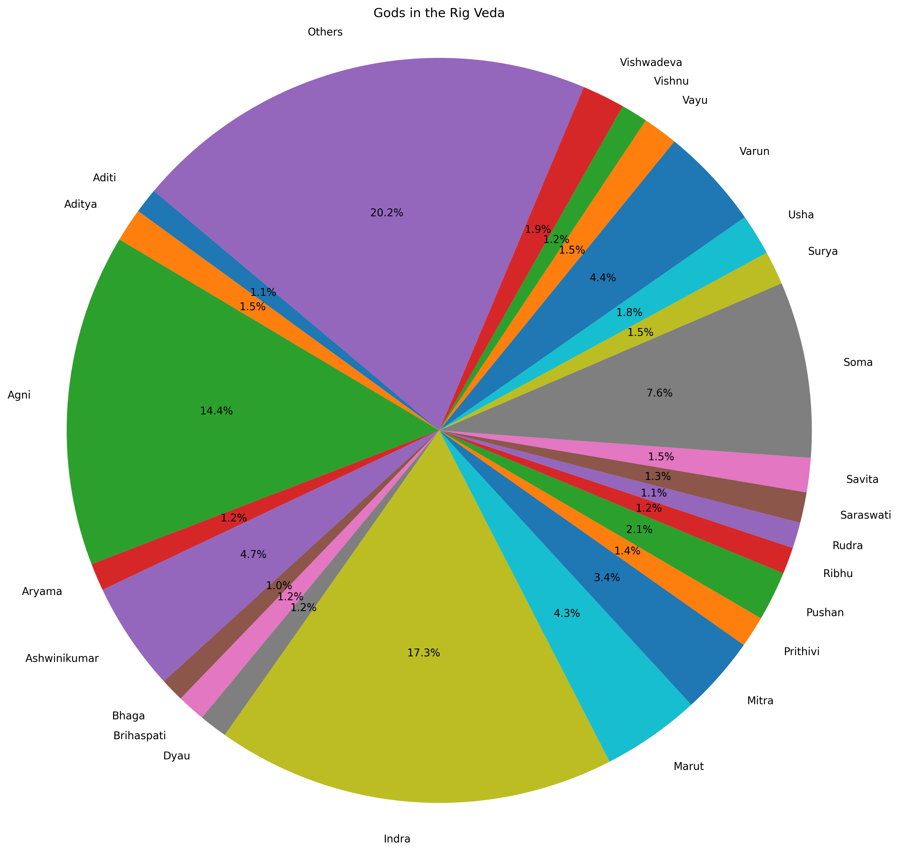

# Pie chart: Gods

<hr/>

This tutorial shows you how to draw a piechart of the vedic meters.

<p style="font-size: 75%;">To see a larger image, click the image.</p>
<a href="../images/gods_pie_chart.png"></a>

---------

**On this page**

* TOC
{:toc}

---------

## Endpoint to use

```
/mandal/{n}/sungfor
```

Fetch, and save, the results for all mandals one by one.

## API response

```
{
...
    "Ashwinikumar": 3,
    "Bhaga": 1,
    "Birds": 2,
    "Brahmanaspati": 6,
    "Brihaspati": 4,
    "Door": 1,
    "Dyau": 2,
    "Grass": 1,
...
}
```

## Code to plot the pie chart

```python
import matplotlib.pyplot as plt
from collections import defaultdict

# Example input: list of all mandal objects
mandals = [
    {"mandal":1,"sungfor":{"Aditi":7,"Aditya":4,"Agastya Maitravaruni":2,"Agnayi":1,"Agni":83,"Ahirbudhnya":1,..."Vishnu":7,"Vishwadeva":6,"Winds":1}},
    {"mandal":2,"sungfor":{"Aditi":2,"Aditya":3,"Agni":15,..."Usha":1,"Vanaspati":1,"Varun":5,"Varunani":1,"Vasu":1,"Vayu":1,"Vishwadeva":1}}
    # Add mandals 3–10 here
]

# Aggregate counts across all mandals
total_counts = defaultdict(int)

for mandal in mandals:
    for deity, count in mandal["sungfor"].items():
        total_counts[deity] += count

# Convert to lists
labels = list(total_counts.keys())
sizes = list(total_counts.values())

# Optional: group small slices for readability
threshold = 15
filtered_labels = []
filtered_sizes = []
other_sum = 0

for label, size in zip(labels, sizes):
    if size < threshold:
        other_sum += size
    else:
        filtered_labels.append(label)
        filtered_sizes.append(size)

if other_sum > 0:
    filtered_labels.append("Others")
    filtered_sizes.append(other_sum)

# Plot pie chart
plt.figure(figsize=(14, 14))

plt.pie(
    filtered_sizes,
    labels=filtered_labels,
    autopct='%1.1f%%',
    startangle=140
)

plt.title("Gods in the Rig Veda")
plt.axis('equal')

# Save image
plt.savefig("gods_pie_chart.png", dpi=300, bbox_inches="tight")

plt.show()
```

The image that is generated by this example code is a bit different from the image at the top of this page, the complete code for which is given in [pie chart of gods](https://github.com/AninditaBasu/indica/blob/master/scripts/pie_3step_cascade.py). 

## What to do next

Draw similar charts for poets.

<p style="font-size: 75%;">To see a larger image, click the image.</p>
<a href="../images/rishis.png"></a>


