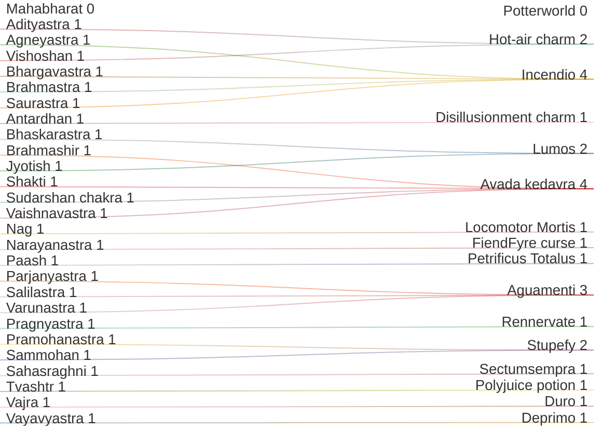

# Sankey diagram: Mahabharat weapons in Potterworld

This diagram is generated from the data returned by `/mb/v1/weapons`.

```mermaid
sankey-beta
Mahabharat,Potterworld,Value
Adityastra,Hot-air charm,1
Agneyastra,Incendio,1
Antardhan,Disillusionment charm,1
Bhargavastra,Incendio,1
Bhaskarastra,Lumos,1
Brahmashir,Avada kedavra,1
Brahmastra,Incendio,1
Jyotish,Lumos,1
Nag,Locomotor Mortis,1
Narayanastra,FiendFyre curse,1
Paash,Petrificus Totalus,1
Parjanyastra,Aguamenti,1
Pragnyastra,Rennervate,1
Pramohanastra,Stupefy,1
Sahasraghni,Sectumsempra,1
Salilastra,Aguamenti,1
Sammohan,Stupefy,1
Saurastra,Incendio,1
Shakti,Avada kedavra,1
Sudarshan chakra,Avada kedavra,1
Tvashtr,Polyjuice potion,1
Vaishnavastra,Avada kedavra,1
Vajra,Duro,1
Varunastra,Aguamenti,1
Vayavyastra,Deprimo,1
Vishoshan,Hot-air charm,1
```

