# Timeline: Mahabharat

<hr/>

This timeline is generated from the data returned by `/mb/v1/events?fields=full`.

```mermaid
graph TD
Pandavas_at_Hastinapur["Pandavas at Hastinapur"]
Bheems_disappearance["Bheem's disappearance"]
Weapon_exhibition["Weapon exhibition"]
Drupads_defeat["Drupad's defeat"]
Varnavat_visit["Varnavat visit"]
Satrajit_killing["Satrajit killing"]
Lakshagriha_burning["Lakshagriha burning"]
Hidimb_killing["Hidimb killing"]
Bak_killing["Bak killing"]
Draupadi_swayamvar["Draupadi swayamvar"]
Arjuns_exile_begins["Arjun's exile begins"]
Uloopi_marriage["Uloopi marriage"]
Chitrangada_marriage["Chitrangada marriage"]
Subhadra_marriage["Subhadra marriage"]
Khandav_burning["Khandav burning"]
Rajasuya_begins["Rajasuya begins"]
Jarasandh_killing["Jarasandh killing"]
Northern_campaign["Northern campaign"]
Southern_campaign["Southern campaign"]
Eastern_campaign["Eastern campaign"]
Western_campaign["Western campaign"]
Shishupal_killing["Shishupal killing"]
Dice_game["Dice game"]
Dice_exile_begins["Dice exile begins"]
Shalwa-Yadav_battle["Shalwa-Yadav battle"]
Kirmir_killing["Kirmir killing"]
Quest_for_celestial_weapons_begins["Quest for celestial weapons begins"]
Kirat-Arjun_fight["Kirat-Arjun fight"]
Indralok_visit["Indralok visit"]
Nivatkavach_battle["Nivatkavach battle"]
Pilgrimage_of_other_Pandavas_begins["Pilgrimage of other Pandavas begins"]
Jata_killing["Jata killing"]
Yaksh_battle_for_lotus["Yaksh battle for lotus"]
Duryodhan-Gandharv_fight["Duryodhan-Gandharv fight"]
Draupadi_abduction["Draupadi abduction"]
Karn-Indra_barter["Karn-Indra barter"]
Incognito_year_begins["Incognito year begins"]
Keechak_killing["Keechak killing"]
Cattle_raid["Cattle raid"]
Abhimanyu-Uttara_wedding["Abhimanyu-Uttara wedding"]
Krishna_on_peace_mission["Krishna on peace mission"]
Bharat_war_begins["Bharat war begins"]
Bhagvad_Gita["Bhagvad Gita"]
Bheeshma_removal["Bheeshma removal"]
Abhimanyu_killing["Abhimanyu killing"]
Jayadrath_killing["Jayadrath killing"]
Ghatotkach_killing["Ghatotkach killing"]
Drona_killing["Drona killing"]
Narayanastra_used["Narayanastra used"]
Karn_killing["Karn killing"]
Shalya_killing["Shalya killing"]
Mace_fight["Mace fight"]
Night_of_killings["Night of killings"]
Brahmashir_used["Brahmashir used"]
Coronation["Coronation"]
Bheeshma_death["Bheeshma death"]
Ashwamedh["Ashwamedh"]
Kuntis_forest_departure["Kunti's forest departure"]
Yadav_brawl["Yadav brawl"]
Installation_of_kings["Installation of kings"]
Pandava_departure["Pandava departure"]
Pandavas_at_Hastinapur --> Bheems_disappearance
Bheems_disappearance --> Weapon_exhibition
Weapon_exhibition --> Drupads_defeat
Drupads_defeat --> Varnavat_visit
Varnavat_visit --> Lakshagriha_burning
Satrajit_killing --> Draupadi_swayamvar
Satrajit_killing --> Subhadra_marriage
Lakshagriha_burning --> Hidimb_killing
Hidimb_killing --> Bak_killing
Bak_killing --> Draupadi_swayamvar
Draupadi_swayamvar --> Arjuns_exile_begins
Arjuns_exile_begins --> Uloopi_marriage
Uloopi_marriage --> Chitrangada_marriage
Chitrangada_marriage --> Subhadra_marriage
Subhadra_marriage --> Khandav_burning
Khandav_burning --> Rajasuya_begins
Rajasuya_begins --> Shishupal_killing
Jarasandh_killing --> Shishupal_killing
Northern_campaign --> Shishupal_killing
Southern_campaign --> Shishupal_killing
Eastern_campaign --> Shishupal_killing
Western_campaign --> Shishupal_killing
Shishupal_killing --> Dice_game
Shishupal_killing --> Shalwa-Yadav_battle
Dice_game --> Dice_exile_begins
Dice_exile_begins --> Kirmir_killing
Shalwa-Yadav_battle --> Abhimanyu-Uttara_wedding
Shalwa-Yadav_battle --> Yadav_brawl
Kirmir_killing --> Pilgrimage_of_other_Pandavas_begins
Kirmir_killing --> Quest_for_celestial_weapons_begins
Quest_for_celestial_weapons_begins --> Kirat-Arjun_fight
Kirat-Arjun_fight --> Indralok_visit
Indralok_visit --> Nivatkavach_battle
Nivatkavach_battle --> Duryodhan-Gandharv_fight
Pilgrimage_of_other_Pandavas_begins --> Jata_killing
Jata_killing --> Yaksh_battle_for_lotus
Yaksh_battle_for_lotus --> Duryodhan-Gandharv_fight
Duryodhan-Gandharv_fight --> Draupadi_abduction
Draupadi_abduction --> Incognito_year_begins
Karn-Indra_barter --> Incognito_year_begins
Incognito_year_begins --> Cattle_raid
Keechak_killing --> Cattle_raid
Cattle_raid --> Abhimanyu-Uttara_wedding
Abhimanyu-Uttara_wedding --> Krishna_on_peace_mission
Krishna_on_peace_mission --> Bharat_war_begins
Bharat_war_begins --> Bhagvad_Gita
Bhagvad_Gita --> Bheeshma_removal
Bheeshma_removal --> Abhimanyu_killing
Abhimanyu_killing --> Jayadrath_killing
Jayadrath_killing --> Ghatotkach_killing
Ghatotkach_killing --> Drona_killing
Drona_killing --> Narayanastra_used
Narayanastra_used --> Karn_killing
Karn_killing --> Shalya_killing
Shalya_killing --> Mace_fight
Mace_fight --> Night_of_killings
Night_of_killings --> Brahmashir_used
Brahmashir_used --> Coronation
Coronation --> Bheeshma_death
Bheeshma_death --> Ashwamedh
Ashwamedh --> Kuntis_forest_departure
Kuntis_forest_departure --> Yadav_brawl
Yadav_brawl --> Installation_of_kings
Installation_of_kings --> Pandava_departure
```



Code snippet for Python:

```python

lines = []
lines.append("```mermaid")
lines.append("graph TD")


# Create node IDs
def node_id(name):
    return name.replace(" ", "_").replace("'", "")


# Create nodes
for e in events:
    name = e["eventName"]
    nid = node_id(name)
    lines.append(f'{nid}["{name}"]')

# Create edges from followedBy
for e in events:
    src = node_id(e["eventName"])

    for nxt in e.get("eventFollowedBy", []):
        dst = node_id(nxt)
        lines.append(f"{src} --> {dst}")

lines.append("```")

```